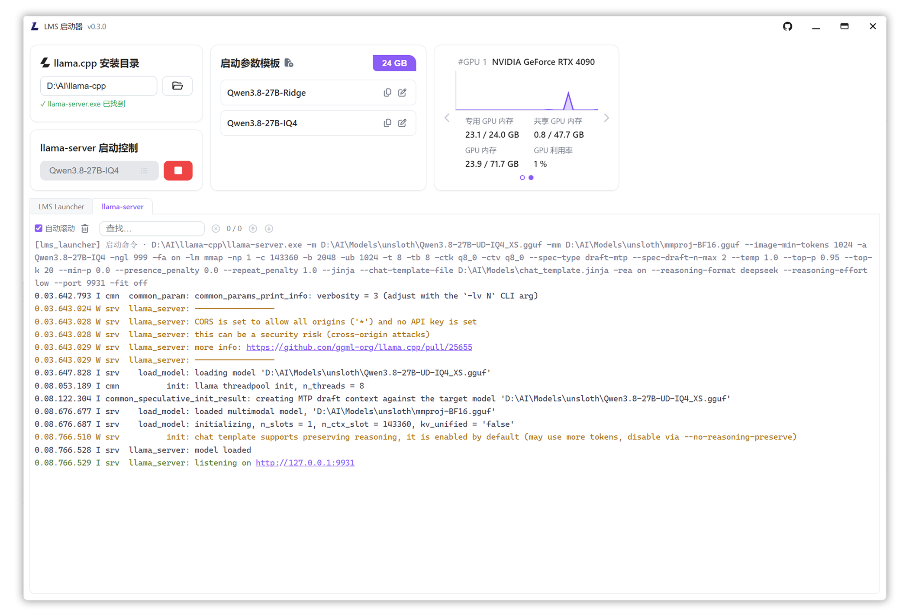

# LMS 启动器

<div align="center"></div>

Windows 桌面版 llama-server 图形化启动器, 基于 llama.cpp, 无需命令行, 选择模板后一键启动本地大模型推理服务

主要功能:

- 记住 llama.cpp 安装位置
- 常用启动参数保存为模板, 覆盖模型文件、端口、GPU 层数、量化、采样等 40+ 参数
- 一键启动与停止服务, 多页签实时日志
- 系统托盘运行, 关闭窗口仅隐藏, 服务继续运行

## 下载安装

前往 [Releases](https://github.com/Gelomen/lms_launcher/releases) 页面下载 `.zip` 压缩包, 解压后直接运行 `lms_launcher.exe` 即可

## 编译

环境要求为 `Windows` 和 `Node.js`

1. 安装依赖:

```bash
npm install
```

2. 开发模式, 热重载并自动打开应用窗口:

```bash
npm run dev
```

3. 构建前端与主进程:

```bash
npm run build
```

4. 打包 `portable` 版 `.exe`, 也可以使用仓库根目录的 `build.bat` 一键完成清理、构建与打包:

```bash
npx electron-builder
```

产物为 `dist-release/win-unpacked/lms_launcher.exe`

5. 运行测试:

```bash
npm test
```

## 卡片功能

| 卡片 | 说明 |
|------|------|
| llama.cpp 安装目录 | 点文件夹图标选择包含 `llama-server.exe` 的目录, 校验通过后自动保存, 下次启动自动读取; 每次启动应用时立即校验一次, 结果在卡片显示 ✓/✗ |
| 启动参数模板 | 新建、编辑、复制、删除启动参数模板, 每个模板至少填写模型文件 `-m`, 枚举参数从下拉选择, 文件参数在弹窗中直接选文件; 右上角 VRAM 按钮可配置显卡显存总量, 编辑模板时据此估算显存占用 |
| 启动控制 | 下拉选择模板后点启动按钮, 完整启动命令记入日志; 运行中按钮变红停止, 点击后优雅停止, 3 秒无响应则强制结束进程 |
| 系统 GPU | 每 2 秒采样显卡利用率与显存占用, 多显卡时左右轮播切换 |
| 日志面板 | 分 LMS 启动器与 llama-server 两个页签, 实时滚动日志, 链接 Ctrl+点击用浏览器打开, 可分别清空 |
| 托盘右键菜单 | 提供打开、检查更新、代理设置、退出 |
